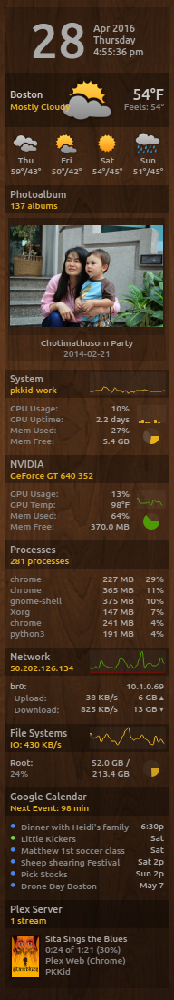

# PKMeter

PyQT5/Python app to display system stats and meters on your desktop. Plugin
system allows creating new meters quickly. I believe the following features
are what makes this app different from the other solutions out there:

* Quickly create new plugins with Python.
* Simple HTML template system.
* Prefrences set in the app (not cmd line scripts).

Current meters include:
* Clock
* External IP
* File System
* Google Calendar
* LmSensors
* NVIDIA
* Network
* Picasa Images
* Plex Media (recently added items)
* Plex Server (currently streaming items)
* Processes
* Sickbeard/SickRage
* Sonarr
* System Monitor
* Weather Underground
* Yahoo! Weather

### Requirements
* Python3, PyQT5
* icalendar
* keyring
* netifaces
* plexapi
* psutil
* python-dateutil
* xmltodict
* hg+https://mjs7231@bitbucket.org/gleb_zhulik/py3sensors
